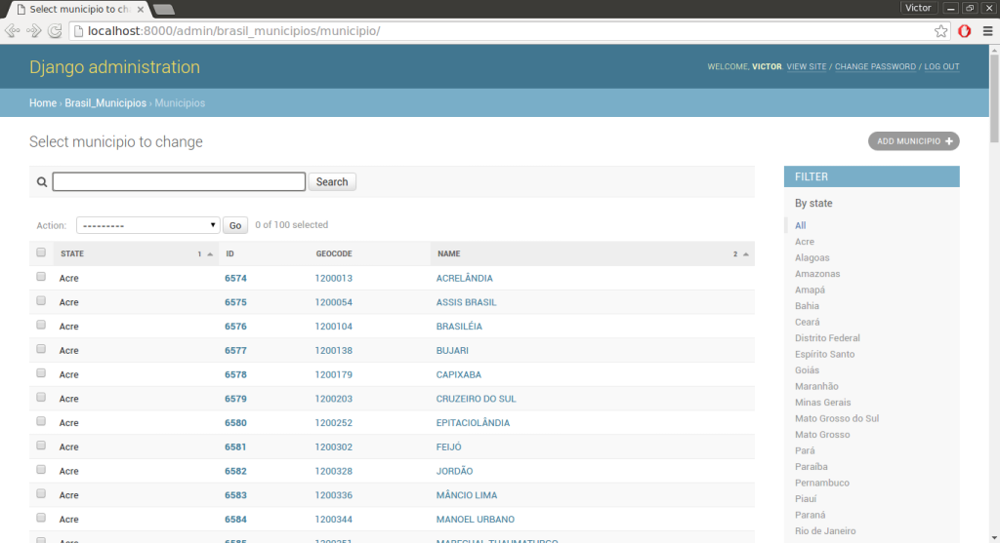
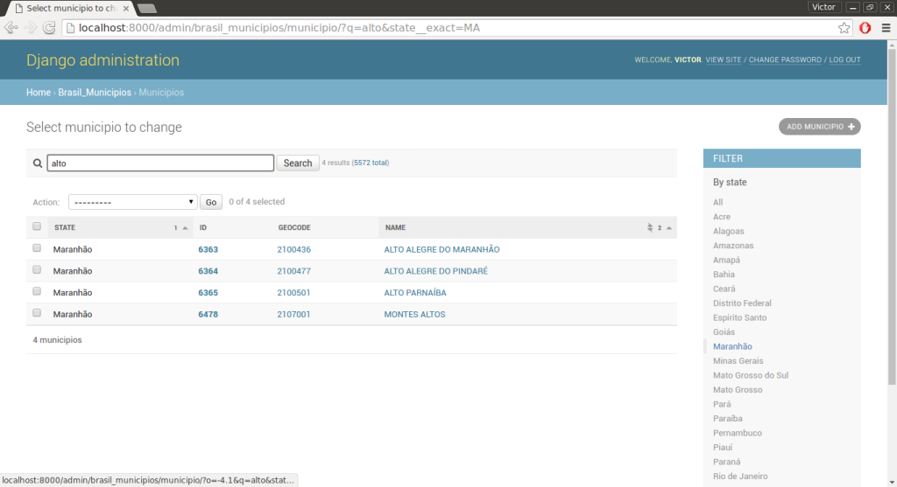
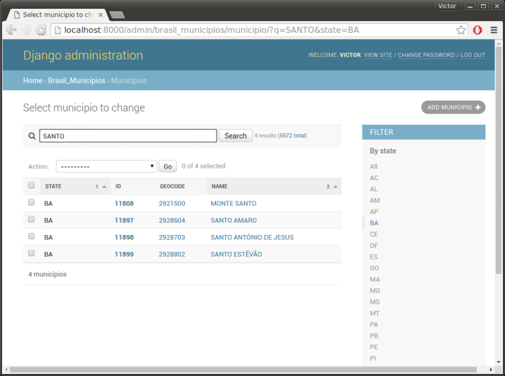

.. |project-name| replace:: **django-brasil-municipios**

==============
|project-name|
==============

This is the documentation for |project-name|, a `GeoDjango <https://docs.djangoproject.com/en/dev/ref/contrib/gis/>`_ app with all Brazilian municipalities and their geographical polygons, with data downloaded from the IBGE (Brazilian Institute of Geography and Statistics) `website <http://downloads.ibge.gov.br/downloads_geociencias.htm>`_.

*********
Demo Code
*********

::

    >>> from django.contrib.gis.geos import Point
    >>> from brasil_municipios.models import Municipio
    >>>
    >>> cristo_redentor = Point(-43.210493, -22.951906, srid=4326)
    >>> municipio_cristo = Municipio.objects.get(geometry__contains=cristo_redentor)
    >>> municipio_cristo.name, municipio_cristo.geocode, municipio_cristo.state
    ('RIO DE JANEIRO', '3304557', 'RJ')
    

************
Installation
************

First of all, your Django project must meet the `requirements for GeoDjango <https://docs.djangoproject.com/en/dev/ref/contrib/gis/install/>`_, including a spatial database and geospatial libraries.

-----------
Install app
-----------

You can install |project-name| in your environment from the `Python Package Index <https://pypi.python.org/pypi>`_::
    
    $ pip install django-brasil-municipios
    
---------------
Update settings
---------------

On your project's settings, add ``'brasil_municipios'`` to your
`INSTALLED_APPS list <https://docs.djangoproject.com/en/dev/ref/settings/#installed-apps>`_.

*********
Load data
*********

First, run |project-name|'s migrations in order to create the app's tables in the database::
    
    $ python manage.py migrate brasil_municipios

Then, you can run the following command to actually download the Brazilian municipalities' data::
    
    $ python manage.py loadmunicipios

That will take some time to complete. Once the data is successfully imported, you can start a `Django shell <https://docs.djangoproject.com/en/dev/ref/django-admin/#shell>`_ and run the example shown before in the `Demo Code`_.

-------------------------------------------------------------
Error ``ftplib.error_perm: 550 Failed to change directory.``
-------------------------------------------------------------

If the error ``ftplib.error_perm`` is raised when you try to load the data, it's because
`IBGE <http://downloads.ibge.gov.br/downloads_geociencias.htm>`_ changed the directory structure of
their FTP server. This means that this library must be updated to match their new structure.
Just `open an issue on GitHub <https://github.com/victor-o-silva/django-brasil-municipios/issues/new>`_
to let me know of the problem, and I'll have it fixed as soon as possible.

-----------------------------
Load data for selected states
-----------------------------

If you don't want to load data for the municipalities of all the Brazilian states, you can specify the desired states with the ``--state`` flag.

Load data only for São Paulo (SP)::

    $ python manage.py loadmunicipios --state SP

Load data only for Tocantins (TO) and Maranhão (MA)::

    $ python manage.py loadmunicipios --state TO --state MA

************
Django Admin
************

If your project uses `Django Admin <https://docs.djangoproject.com/en/dev/ref/contrib/admin/>`_, |project-name| will appear in it, and you will be able to view the municipalities in a map:

.. Contents:
.. 
.. .. toctree::
..    :maxdepth: 2
